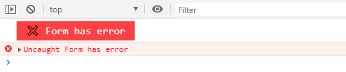

<p align="center">
	<a href="https://balzaclegeek.github.io/lightformvalidator" target="_blank">
		
	</a>
</p>

[Light Form Validator][1] is a light **JS plugin** written with Vanilla JS, no dependencies, used to make a simple but strong form validation.

Wanna try it?
------------
Great!!! Let's install this plugin

### For basic web project
- Include this script in your html code
```html
<script src="https://balzacLeGeek.github.io/lightformvalidator/index.js"></script>
```

### Using NPM / Yarn
Installation steps goes here :)

Documentation
------------
### API

- [LightValidator instance](#new-lightvalidatoroptions)
- [Process Validation](#validatecallback)
- [Console is your friend](#console-is-your-friend)

### new LightValidator(options)
Creates an instance of LightValidator.

- `options` An options object
```javascript
{
	id: YOUR_FORM_ID, // Required option
}
```

### validate(callback)
Process the form validation and pass the `Serialized form datas` to a callback function. If no callback function has provided, `Serialized form datas` are returned.

### Console is your friend
- ***❌ Form with id "YOUR_FORM_ID" not found***
You have provided a wrong id
<p align="left">
	
</p>

- ***❌ Invalid Node Element***
The given ID doesn't match to any **form** element.
<p align="left">
	
</p>

- ***❌ Form has error***
One or more required fields are not valid
<p align="left">
	
</p>

- **🥳 Everything is OK**
<p align="left">
	
</p>

## Usage example
The following HTML code uses boostrap form.

```html
<form id="myForm" novalidate>
	<div class="form-group">
		<label for="name">Fullname</label>
		<input type="text" name="name" id="name" class="form-control" placeholder="Enter your fullname" required>
	</div>
	<div class="form-group">
		<label for="email">Email address</label>
		<input type="email" name="email" class="form-control" id="email" placeholder="Enter email" required>
	</div>
	<div class="form-group">
		<label for="password">Password</label>
		<input type="password" name="password" class="form-control" id="password" placeholder="Password" required>
	</div>
	<div class="form-group">
		<label for="sexe">Gender</label>
		<div class="custom-control custom-radio custom-control-inline">
			<input class="custom-control-input" type="radio" id="gender-mr" name="gender" value="mr" checked>
			<label class="custom-control-label" for="gender-mr">Mr</label>
		</div>
		<div class="custom-control custom-radio custom-control-inline">
			<input class="custom-control-input" type="radio" id="gender-mme" name="gender" value="mme">
			<label class="custom-control-label" for="gender-mme">Mme</label>
		</div>
	</div>
	<div class="form-group">
		<label for="langage">langage</label>
		<select class="form-control" name="langage" id="langage">
			<option value="MG">Malagasy</option>
			<option value="FR">French</option>
			<option value="EN">English</option>
		</select>
	</div>
	<button type="submit" class="btn btn-primary">Submit</button>
</form>
```

```javascript
// Create an instance of the LightValidator
const myForm = new LightValidator({
	id: 'myForm', // Oour form id's
}) 

// Use validate() method to process validation
myForm.validate(datas  => {
	// Your callback function
	// Ex: Send `datas` object within a POST request
})

// If case you just need the validated datas
// It returns the validated and serialized form datas
const myFormDatas = myForm.validate()
```

## TODO
- [ ] Custom error message from a `data-error` attribute
- [ ] Password validation options. `false` by default
- [ ] Password confirmation validation

## Credits
[Light Form Validator][1] was inspired by an old code of my friend [Rado](https://github.com/radonirinamaminiaina).

Light Form Validator logo fond was picked from [Champagne & Limousines](https://www.dafont.com/fr/champagne-limousines.font) (Dafont).

## License
MIT

[1]: https://balzaclegeek.github.io/lightformvalidator